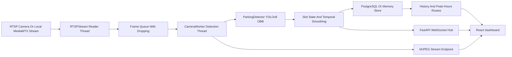

# Architecture

Sightline connects RTSP camera streams to an AI detector, maps detected vehicles onto parking-space polygons, and sends live occupancy updates to a React dashboard.

Some source files still display the old ParkIQ name until the rename issue is completed.

## System Diagram



## Backend Components

- `backend/api/main.py`: FastAPI app, REST routes, WebSocket hub, MJPEG stream endpoint.
- `backend/core/camera_manager.py`: RTSP reader, detection worker, camera registry.
- `backend/core/detector.py`: YOLOv8 OBB inference, polygon IoU, slot state smoothing, frame annotation.
- `backend/services/database.py`: PostgreSQL CRUD with in-memory fallback for local demo use.
- `backend/services/calibration.py`: Auto-calibration helpers for detecting candidate parking spaces.

## Frontend Components

- `frontend/src/pages/Dashboard.jsx`: Main app shell, camera list, stats, stream view, calibration panel.
- `frontend/src/components/SlotMapCanvas.jsx`: Canvas overlay for slot polygons and hover details.
- `frontend/src/components/SlotGrid.jsx`: Live slot state pills.
- `frontend/src/components/CalibrationWizard.jsx`: Camera setup and slot editing flow.
- `frontend/src/hooks/useWebSocket.js`: Live WebSocket connection with reconnect behavior.
- `frontend/src/hooks/useCameraStream.js`: MJPEG stream URL state.

## Runtime Flow

1. A camera is added through the dashboard or API.
2. `CameraManager` starts an `RTSPStream` reader thread.
3. The reader pushes recent frames into a small queue and drops old frames when full.
4. `CameraWorker` consumes frames in a separate detection thread.
5. `ParkingDetector` runs YOLOv8 OBB inference and compares vehicle polygons to slot polygons.
6. Slot votes are smoothed over multiple frames.
7. Changed slots are stored and broadcast over WebSocket.
8. The frontend redraws the slot overlay and stats when state changes.

## Data Storage

PostgreSQL stores cameras, parking slot polygons, and occupancy events. Local development can run without Postgres by using in-memory persistence.

The current analytics endpoints count occupancy events. A future analytics pass should calculate time-weighted occupancy from state intervals.

## Local Demo Data

The tracked PKLot fixture lives in `sample-data/pklot` and includes:

- `preview.jpg`: clean sample image.
- `overlay.jpg`: reference overlay.
- `slots.json`: 100 mapped parking spaces.
- `manifest.json`: sample metadata.

The local RTSP URL used by the docs is:

```text
rtsp://127.0.0.1:8554/parkiq
```
