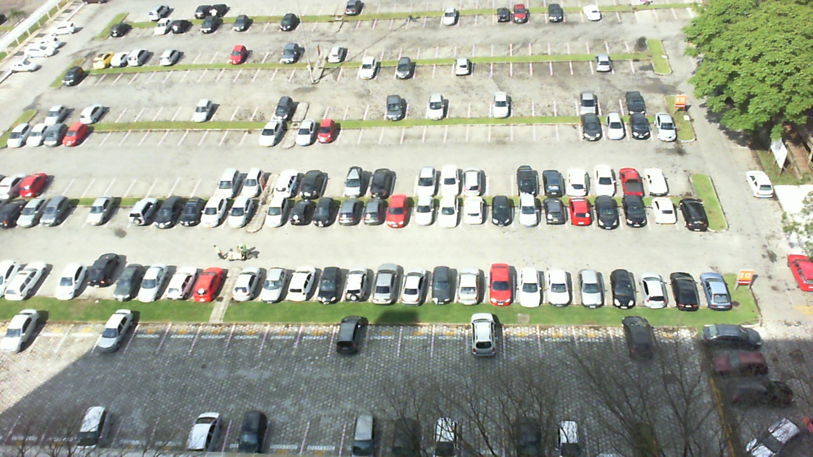
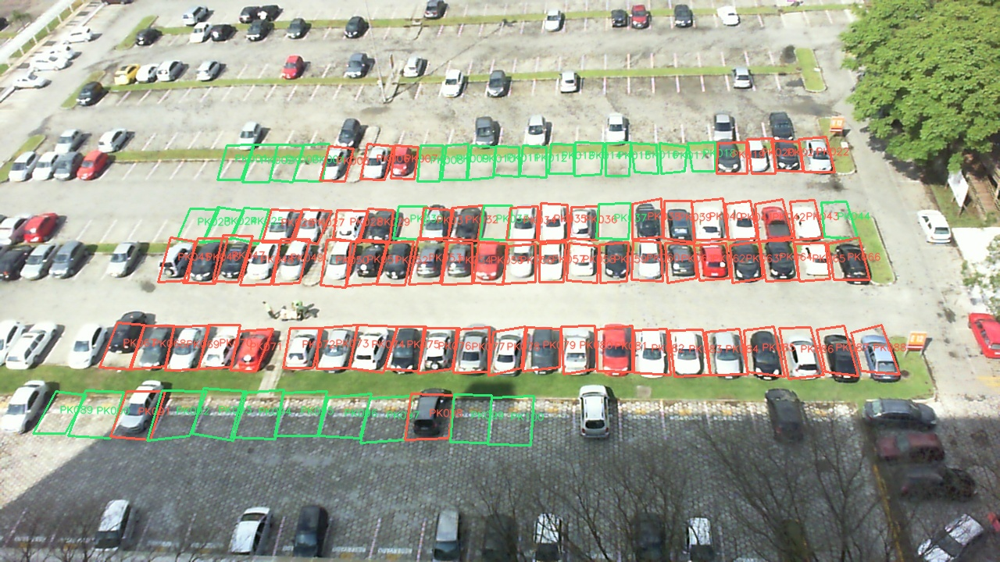

# Demo Media

This repo includes lightweight sample images for demonstrating Sightline without a real camera.

## Sample Images

Clean sample image:



Annotated reference image:



## Local RTSP Demo Link

When MediaMTX and FFmpeg are running locally, enter this RTSP URL in the app:

```text
rtsp://127.0.0.1:8554/sightline
```

## Demo Flow

1. Start MediaMTX.
2. Publish `sample-data/pklot/preview.jpg` as an RTSP stream with FFmpeg.
3. Start the backend and frontend.
4. Open `http://localhost:5173`.
5. Add camera `cam1`.
6. Click `Load PKLot`.

The dashboard should show 100 parking spaces and the live sample stream.

## Recording A Short Demo

The repository does not commit large demo video files. To create a short local demo video, use macOS screen recording or any screen capture tool while the dashboard is running.

Suggested scenes:

- Camera list with `Sample Lot 1` connected.
- Dashboard stats showing total, available, occupied, and occupancy percentage.
- Main stream with green and red slot overlays.
- Calibration panel with the PKLot sample loaded.
